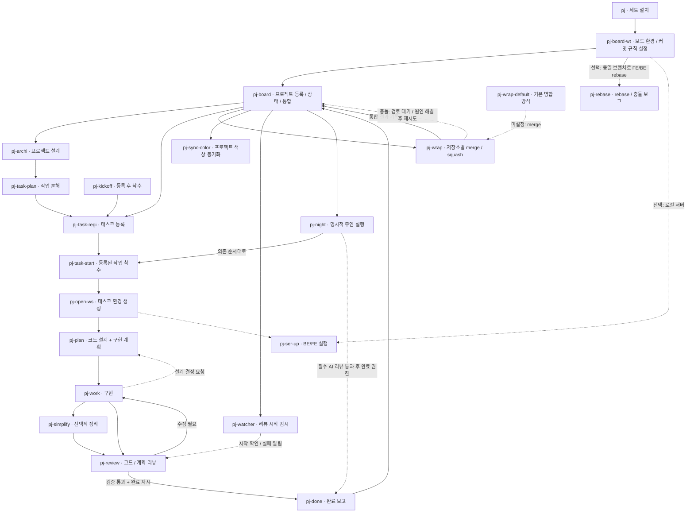

# cmux-ai-pj-teams

PJ는 프로젝트 설계 → 태스크 등록 → 계획·구현·리뷰 → 프로젝트 브랜치 통합을 연결하는
21개 스킬 묶음입니다. 하나의 프로젝트가 여러 Git 저장소를 포함할 수 있습니다.
태스크 상태는 Markdown 파일, 세션 간 전달 내용은 JSONL 파일로 관리합니다.

이 저장소의 루트가 PJ 패키지 루트입니다. `README.md`, `config.example.json`, `_shared/`,
`pj/`와 `pj-*/` 폴더가 같은 위치에 있습니다. 전체를 함께 보관하세요. 각 스킬은 `_shared`의
스크립트와 템플릿을 사용하므로 `SKILL.md`만 따로 복사하면 실행되지 않습니다.

## 1. 스킬 연결 그래프



화살표는 연계 가능 경로입니다. 문서 작성만 요청하면 등록·착수까지 자동 확대하지 않습니다.
기본 실행은 planner/worker 분리이며 `solo`를 명시하면 한 세션이 계획과 구현을 담당합니다.
코드·선택 전문 리뷰는 별도 세션에서 유지하며, solo에서는 별도 계획 리뷰를 생략합니다.
`pj-night`는 solo로 실행하고, 사용자가 명시한 경우에만 무인 설계·작업·로컬 통합을 수행합니다.
`pj-done` 이후에는 보드가 로컬 프로젝트 브랜치로 통합하므로 완료 지시는 이 동작을 포함합니다.

## 2. 의존 도구와 서비스

| 구분 | 필요 요소 | 사용하는 곳 / 제약 |
|---|---|---|
| 필수 | Python 3.10 이상 | 공용 스크립트. 실행 의존성은 표준 라이브러리 |
| 필수 | Git CLI | 브랜치, worktree, diff, merge / squash. `--path-format=absolute` 지원 필요 |
| 필수 | Bash와 POSIX 파일시스템 | worktree 스크립트, 심볼릭 링크, `fcntl` 잠금 사용 |
| 세션 실행 필수 | cmux 앱 및 `cmux` CLI | workspace/group, pane/surface, tree/process, send/buffer, 색상, Markdown viewer 기능 필요 |
| 로컬 서버 실행 시 | lsof, 설정한 패키지 관리자·서버 CLI | pj-ser-up의 포트 점유 검사·서버 실행. Node preload는 Node 앱에서만 선택 |
| 타입검사를 별도로 실행할 때 | Node.js와 저장소에 설치된 TypeScript | 선택 도우미를 사용할 때만 필요. PJ 완료·리뷰·통합의 필수 의존성이 아님 |
| 프로젝트별 선택 | 패키지 관리자, 빌드·테스트 도구 등 | 해당 저장소가 요구할 때만. PJ 자체는 특정 웹/백엔드 프레임워크를 요구하지 않음 |
| 개발 검증만 | pytest, PyYAML | 회귀 테스트 / 스킬 frontmatter 검증용. 일반 실행에는 불필요 |

cmux가 없는 환경에서도 태스크 파일 조회·편집 도우미는 사용할 수 있지만 세션 생성·전달은
동작하지 않습니다. 현재 스크립트는 POSIX 기반이며 Windows 네이티브는 지원하지 않습니다.
cmux 실제 UI와 AI 서비스까지 연결한 실행은 별도로 확인해야 합니다.
Obsidian, Jira, 개인 셸 별칭, 별도 질문 스킬·merge 스킬은 필요하지 않습니다.

## 3. 사용 가능한 AI 모델

PJ는 아래 AI 모델 계열을 해당 CLI를 통해 사용합니다. 보드·계획·구현·리뷰 역할마다
실행 프로필을 선택할 수 있으므로, 한 프로젝트에서 여러 모델 계열을 함께 사용할 수 있습니다.

| AI 모델 계열 | 실행 도구 | 기본 프로필 | 사용 조건 |
|---|---|---|---|
| Claude 계열 | Claude Code (`claude`) | `claude` | 설치한 CLI와 로그인한 계정에서 제공하는 모델 사용 |
| OpenAI GPT·Codex 계열 | Codex CLI (`codex`) | `codex` | 설치한 CLI와 로그인한 계정에서 제공하는 모델 사용 |
| Grok 계열 | Grok CLI (`grok`) | `grok` | 선택 프로필. 해당 CLI의 스킬 탐색과 cmux 연동은 사용자 설치에서 확인 |

기본 프로필은 특정 모델 버전을 고정하지 않고 각 CLI의 설정을 따릅니다. 사용할 수 있는
구체적인 모델·추론 강도는 설치한 CLI와 계정에 따라 달라집니다. 원하는 모델과 옵션은
`launchers.local.json`의 프로필 `argv`에 지정하며, PJ가 모델 이름이나 옵션을 자동 변환하지는
않습니다. 설정 방법은 [실행 프로필 안내](pj/references/portable-setup.md)를 참고하세요.

선택한 CLI가 PATH에서 실행되고 해당 서비스에 로그인되어 있어야 합니다. 계정/API 비용은
각 사용자 환경에 따릅니다. Codex의 자동 세션 전달에는 호환되는 PostToolUse hook 및 신뢰
설정이 필요합니다. 미지원 환경은 허용된 외부 셸에서 수동 relay를 사용할 수 있으며,
무인 실행에는 자동 relay가 필요합니다.

## 4. 사용자가 선택·기입할 설정

패키지 루트의 `config.example.json`을 `config.local.json`으로 복사해 수정합니다.
환경변수 > `config.local.json` > 기본값 순서로 적용됩니다. `~` 또는 절대 경로를 사용하세요.
공백이 있는 경로도 지원합니다. 서로 다른 세트/컴퓨터는 각자의 설정 파일을 사용합니다.

설정 파일은 용도별로 나뉩니다. 예시 파일은 배포용이므로 실제 값은 복사한 로컬 파일에 씁니다.

| 용도 | 배포 예시 → 사용하는 파일 | 준비 시점 |
|---|---|---|
| 데이터·저장소·worktree 경로 | [config.example.json](config.example.json) → 패키지 `config.local.json` | 첫 설치 때 경로 확인 |
| 저장소별 약칭·역할·커밋 규칙 | [repo-aliases.example.json](_shared/data/repo-aliases.example.json) → `PJ_ALIASES`가 가리키는 파일 | 첫 설치 때 저장소 키 수정, 커밋 규칙은 등록 시 저장 |
| AI CLI·모델·계정·리뷰 옵션 | [launchers.example.json](_shared/data/launchers.example.json) → 같은 폴더 `launchers.local.json` | 모델/계정/역할을 바꿀 때. 없으면 예시의 표준 CLI 프로필 사용 |
| 로컬 BE/FE·DB | [servers.example.json](_shared/data/servers.example.json) → 같은 폴더 `servers.local.json` 또는 `--config` 파일 | `pj-ser-up`을 사용할 때만 설정 |

`config.local.json`에는 아래 경로 키만 넣습니다. 모델·병합 방식·night 옵션·watcher 설정을
여기에 추가하면 유효하지 않은 설정으로 거부됩니다.

| 설정 | 미설정 시 기본값 | 사용자가 정할 내용 |
|---|---|---|
| `PJ_VAULT` | `~/.local/share/pj` | 프로젝트·태스크 문서 저장 루트. 내부 `raw/tasks/`는 고정 |
| `PJ_REPOS_ROOT` | `~/projects` | 주 Git 체크아웃들의 부모 폴더. 바로 아래 저장소 폴더를 탐색 |
| `PJ_WORKTREE_ROOT` | `~/worktrees` | 프로젝트/태스크 worktree 생성 루트. 주 저장소 밖의 폴더 선택 |
| `PJ_ALIASES` | 패키지 `_shared/data/repo-aliases.local.json` | 저장소별 설정·커밋 규칙 파일. 새 예시는 `~/.config/pj/repo-aliases.local.json`을 명시해 패키지 밖에 보관 |
| `PJ_CMUX_REGISTRY_ROOT` | `/tmp/cmux-agents` | 실행 중인 AI 프로세스 등록 위치. 모든 PJ 세션에서 동일하게 설정 |

`PJ_PACKAGE_ROOT`는 helper가 실행 파일 위치에서 계산하므로 config에 넣지 않습니다.
패키지를 이동하면 설치 링크를 갱신해야 합니다. 모든 경로는 기본값이 있어 생략할 수 있지만,
저장소·worktree·데이터의 실제 위치가 맞는지는 확인하세요.

기존 사용자는 현재 `PJ_ALIASES`를 유지하면 됩니다. 경로만 바꾸면 기존 별칭·커밋 규칙이
자동 이동하지 않습니다. 옮길 때는 기존 파일을 새 위치로 복사한 뒤 경로를 변경하세요.

병합 방식은 `config.local.json`과 별도로 `pj-wrap-default`에서 관리합니다.
`PJ_VAULT/raw/tasks/pj-wrap-default.json`의 `mode`에 저장하며, 값은 `merge` 또는 `squash`입니다.
우선순위는 이번 `pj-wrap`의 명시적 선택 → 저장된 기본값 → `merge`입니다.
같은 `PJ_VAULT`를 쓰는 모든 보드가 기본값을 공유합니다.

`_shared/data/repo-aliases.example.json`을 설정된 `PJ_ALIASES` 위치로 복사합니다.
예시 저장소 키를 실제 **주 체크아웃 디렉터리명**으로 바꿉니다. 프로젝트와 태스크 slug는
영문 kebab-case를 사용하며 같은 namespace에서 충돌하지 않아야 합니다.

| 저장소 설정 | 선택·기입 방법 |
|---|---|
| 키 | 예: `example-frontend` → 실제 체크아웃 디렉터리명. 저장소별로 고유해야 함 |
| `short` | UI에서 보여줄 저장소 약칭 |
| `commitPolicy` | 저장소 등록 시 분석해 자동 저장하는 커밋 규칙과 출처. 직접 채울 필요 없음 |
| `wtFolder` | worktree 부모 안의 하위 디렉터리명. 한 프로젝트 안에서 중복 금지 |
| `linkPaths` | worktree에 연결할 경로. 기본 `.claude/skills`, `.codex/skills` 유지. 추가 설정/환경 경로는 직접 선택 |
| `envCopy` | 선택. 복사할 저장소 내 환경 파일 경로. 자격증명 파일은 배포 패키지에 넣지 않음 |
| `typecheckChangedCmd` | 선택 도우미를 별도로 사용할 때의 검사기 override. `["실행파일", "{files}"]` argv 배열. PJ 완료 절차에서는 실행하지 않음 |
| `typecheckCmd` | 선택 도우미의 구형 호출 호환용 명령. PJ 완료·리뷰·통합에서는 자동 실행하지 않음 |
| `roleLaunchers` | 선택. `plan`, `work`, `review`별 실행 프로필 ID. 없는 역할은 runtime 기본값 사용 |

예시의 `roleLaunchers: {}`는 역할을 고정하지 않습니다. 저장소별로 바꾸려면 필요한 키만
지정합니다. 예를 들어 `{"plan":"codex","work":"codex","review":"grok"}`는 계획·구현은
Codex, 리뷰 옵션은 Grok을 사용합니다. 명시적 요청의 프로필이 저장소 설정보다 우선하며,
생략한 역할은 실행 runtime 기본값을 따릅니다. `commitPolicy`는 예시에 임의로 채우지 않습니다.

PJ는 `pj-done`·`pj-review`·`pj-wrap`·`pj-night`에서 타입검사를 강제하지 않습니다.
완료 보고에는 저장소별 커밋 상태만 필수이며, 타입검사 미실행은 완료·통합을 막지 않습니다.
타입검사는 사용자의 명시적 요청이나 저장소 자체 규칙에 따라 별도로 수행합니다.
기존 결과를 보고할 경우 선택 필드로 전달하며, 미실행을 통과로 기록하지 않습니다.

선택 도우미 `pj-typecheck.py --changed-only`는 남아 있습니다. 별도로 실행하면 저장소의
TypeScript·tsconfig를 이용해 변경 파일만 검사하며, 다른 도구체인이 필요하면
`typecheckChangedCmd`를 지정할 수 있습니다. Lint 역시 변경 파일만 검사하고 범위를 제한할
수 없는 명령은 건너뜁니다.

`_shared/data/launchers.example.json`은 기본 `claude`, `codex`, `grok` 실행을 제공합니다.
모델/옵션을 지정하려면 `launchers.local.json`으로 복사하고 프로필의 `argv` 배열을
설치한 CLI의 지원 옵션에 맞춰 수정합니다. 기본 `claude`·`codex` 프로필 ID는 유지하고
추가 프로필을 만들어 역할별로 선택하세요. `runtime`은 `claude`, `codex`, `grok` 중 하나이며
스킬 호출 구문을 결정합니다. 새로운 프로필 ID도 사용할 수 있습니다. 모델 별명이나 추론
강도를 자동으로 추측하지 않습니다. 권한 우회 옵션은 기본 제공하지 않습니다.

프로젝트 생성 때는 프로젝트 이름, 저장소 목록, 저장소별 프로젝트 브랜치, 새 브랜치인지
기존 브랜치인지, 공통 문서 `ctx`를 정합니다. 태스크별로 범위·대상 저장소·의존성·완료 기준을
기입합니다. 설계 선택은 이미 정한 내용을 다시 묻지 않고 실제 미결정 사항만 확인합니다.

### 리뷰 옵션과 별도 계정

`launchers.local.json`의 프로필은 `runtime`, `argv`에 더해 선택적으로 `env`,
`reviewOption`, `reviewers`를 가집니다. `env`는 해당 CLI 자식 프로세스에만 전달하며,
`CODEX_HOME`을 지정해 별도 계정을 선택할 수 있습니다. 그 계정의 로그인·hook 설정은
직접 준비합니다. 개인 셸 함수나 모델 별칭은 필요하지 않습니다.

태스크의 review 프로필에 `reviewOption`이 없으면 runtime이 옵션입니다. `code`는 지정한
프로필을 그대로 쓰고, 다른 리뷰어는 같은 옵션의 자기 기본값을 씁니다. 옵션 프로필의
`reviewers`는 `{리뷰어ID: 프로필ID}` 형식으로 이를 재정의합니다. 별도 계정은 자기 ID를
`reviewOption`으로 지정하여 다른 리뷰어도 같은 계정을 선택하도록 합니다.
[프로필·계정 설정 예시](pj/references/portable-setup.md)를 참고하세요.
추가 `grok` 교차 검증 리뷰어는 기존 리뷰어와 함께 선택할 수 있는 별도 역할로 유지합니다.

“리뷰 Grok”은 새로 실행할 코드·전문 리뷰어의 옵션을 바꾸고, “Grok 리뷰어 추가”는 독립 교차 검증
역할을 더합니다. 별도 계정 프로필을 쓰더라도 추가 `grok` 역할은 기본적으로 `grok` 프로필을
사용합니다. 필요한 경우 해당 옵션 프로필의 `reviewers.grok`으로 명시적으로 재정의하세요.
watcher는 보드의 프로필·계정을 상속하므로 별도 watcher 모델 키를 설정하지 않습니다.
기존 리뷰어 세션과 재사용하는 planner의 프로필은 바꾸지 않습니다. `--runtime`은 기본값
선택용으로 `claude|codex`를 받으며, Grok은 `--hint grok` 또는 역할별 프로필로 지정합니다.

## 5. 설치와 첫 실행

아래 경로를 자신의 값으로 바꿔 **일반 셸**에서 실행합니다. 설정 복사는 첫 설치에만 합니다.
이미 작성한 `.local.json` 파일은 덮어쓰지 마세요.

```bash
PJ_PACKAGE_ROOT='/absolute/path/to/cmux-ai-pj-teams'
cp -n "$PJ_PACKAGE_ROOT/config.example.json" "$PJ_PACKAGE_ROOT/config.local.json"
```

`config.local.json`의 경로를 자신의 환경에 맞춘 뒤 다음을 실행합니다. 예시의 별칭 파일
위치는 패키지 밖이므로 부모 폴더도 준비합니다. 기존 설정 파일은 그대로 보존합니다.

```bash
eval "$(python3 "$PJ_PACKAGE_ROOT/_shared/scripts/pj_config.py" --shell)"
mkdir -p "$(dirname "$PJ_ALIASES")"
cp -n "$PJ_PACKAGE_ROOT/_shared/data/repo-aliases.example.json" "$PJ_ALIASES"
# 모델·계정·역할별 프로필을 편집할 때만 복사:
cp -n "$PJ_PACKAGE_ROOT/_shared/data/launchers.example.json" "$PJ_PACKAGE_ROOT/_shared/data/launchers.local.json"
```

`PJ_ALIASES` 파일의 예시 저장소 키를 실제 체크아웃 디렉터리명으로 바꾸고 설치합니다.
CLI 프로필을 수정했다면 `argv`와 로그인·계정 설정도 확인하세요.
설치 명령은 아래 한 줄입니다. `--project`에는 스킬을 사용할 프로젝트 폴더를 넣습니다.

```bash
python3 "$PJ_PACKAGE_ROOT/_shared/scripts/install.py" --project '/absolute/path/to/your-project'
```

변경 예정 링크만 보고 싶을 때는 이 명령 끝에 `--dry-run`을 붙입니다.
`launcher parse`는 프로필 선택을 점검하는 도우미이며 설치 단계에 필요하지 않습니다.

여러 저장소를 사용할 때는 각 주 체크아웃에 설치합니다. 설치기는 `pj` 포함 21개 스킬과
`_shared`를 `.claude/skills/`와 `.codex/skills/` 양쪽에 연결하며 기존 항목과 충돌하면
아무 링크도 새로 만들지 않고 오류를 냅니다. 충돌 경로를 확인한 후 직접 정리하세요.
로컬 링크와 runtime 설정을 소비 프로젝트에서 어떻게 관리할지는 그 프로젝트 규칙에 따릅니다.
`git status`에 생성된 `.claude/skills`·`.codex/skills` 링크가 미추적 파일로 남으면 완료 검사와
worktree 정리가 막힙니다. 코드로 관리하지 않는 링크는 소비 저장소의 로컬 exclude 파일
(`git rev-parse --git-path info/exclude`)에 해당 경로를 등록하세요. 끝에 `/`를 붙이지 않아야
심볼릭 링크도 제외됩니다. 환경 파일 등 추가 `linkPaths`도 같은 기준으로 결정합니다.
설치기는 소비 저장소의 ignore 설정을 자동 변경하지 않습니다.
배포 폴더와 링크 대상은 같은 컴퓨터에 있어야 합니다.

cmux 터미널에서 소비 프로젝트로 이동한 후 최초 세션도 등록 래퍼로 시작합니다:

```bash
python3 "$PJ_PACKAGE_ROOT/_shared/scripts/pj-launch.py" --profile claude
# Codex는 --profile codex, Grok은 --profile grok, 별도 계정은 해당 프로필 ID
```

Claude/Grok은 `/pj-*`, Codex는 `$pj-*`로 호출합니다. 이후 세션은 같은 래퍼로 자동 시작됩니다.

1. `pj-board-wt`: 프로젝트 이름·저장소·프로젝트 브랜치를 전달해 보드 환경 생성·커밋 규칙 저장.
2. 새 보드에서 `pj-board`: 프로젝트 등록. 공통 문서·색상 설정, 저장된 커밋 규칙 확인·누락 보완.
3. `pj-archi` → `pj-task-plan`: 설계하고 작업을 분해. 작은 작업은 기존 설계를 활용.
4. `pj-task-regi`로 등록 후 `pj-task-start`로 착수. 한 번에 하려면 `pj-kickoff`.
5. planner가 `pj-plan`, worker가 `pj-work` 및 `pj-review` 수행. 필요하면 `pj-simplify`.
6. 완료 지시를 받은 worker가 `pj-done`, 보드가 `pj-wrap` 수행. 원격 push/PR은 포함하지 않음.

Codex의 자동 전달 설정과 수동 relay는
[pj/references/cmux-orchestration.md](pj/references/cmux-orchestration.md)를 참고하세요.
설치기는 전역 hook 파일을 수정하지 않습니다. `hook doctor`는 설정 검사이며 실제 전달 성공을
보장하지 않습니다. 분리 세션과 무인 실행 전에 실제 요청의 처리 응답까지 확인하세요.

### 저장소 커밋 규칙

`pj-board-wt`에서 저장소를 설정하거나 `pj-board`에서 프로젝트를 등록할 때 커밋 규칙도
분석해 `PJ_ALIASES`의 `aliases.<repoKey>.commitPolicy`에 저장합니다. 저장소의
AGENTS·CLAUDE·CONTRIBUTING, commitlint·메시지 템플릿을 우선 확인하고, 명시된 규칙이
없으면 최근 일반 커밋 최대 30개의 제목에서 일관된 형식을 확인합니다.

제목 형식, 언어, 본문·footer, 이슈 번호 처리, merge/squash 메시지 규칙과 함께 근거 파일,
분석 시점·커밋을 기록합니다. `pj-done`과 `pj-wrap`은 저장된 값을 읽어 사용하며 매번
커밋 이력을 재분석하지 않습니다. 규칙 파일이 바뀌거나 사용자가 갱신을 요청하면 다시
분석합니다. 새 커밋이 추가됐다는 이유만으로는 재분석하지 않습니다.

규칙이 불명확하면 확인이 필요한 상태로 저장하고 형식을 한 번 확인합니다. 저장소 등록은
계속할 수 있지만 불확실한 형식을 커밋에 임의로 적용하지 않습니다. 기존 등록 저장소는
첫 커밋·통합 시 누락된 규칙을 보완하며, 현재 사용자·저장소 지침을 우선합니다.
분석·저장 절차는 [commit-policy.md](pj/references/commit-policy.md)에 있습니다.

작업 커밋은 `pj-done`이, 통합 커밋은 `pj-wrap`이 저장된 규칙으로 작성합니다.
`pj-wrap`은 통합 메시지에 `PJ-Task`, `PJ-Source`, `PJ-Wrap-Mode` trailer도 남깁니다.
저장소 규칙이 이 trailer를 금지하면 실제 통합 전에 충돌하는 요구사항을 해결합니다.

### 병합 방식 선택

스킬 호출 예시:

```text
./pj-wrap-default                 현재 기본값 확인
./pj-wrap-default merge           기본값을 일반 merge로 저장
./pj-wrap-default squash          기본값을 squash로 저장
./pj-wrap task-slug               저장된 기본값 사용(미설정: merge)
./pj-wrap task-slug squash        이번 통합만 squash
./pj-wrap task-slug --mode merge  이번 통합만 merge
```

`./` 표기는 AI에게 전달하는 스킬 호출로 해석합니다. `merge`는 기존 태스크 커밋을 보존하고
병합 커밋을 남깁니다(`--no-ff`). `squash`는 변경을 새 커밋 하나로 합칩니다.
기본값 조회·변경에는 cmux가 필요하지 않으며, 설정 변경만으로 코드가 병합되지는 않습니다.
보드 자동 통합과 `pj-night`도 `pj-wrap`의 선택 방식을 따릅니다. 진행 중인 병합에는 시작할 때
선택한 방식을 유지하고, 다음 통합부터 변경된 기본값을 적용합니다.

### 커밋 전 리뷰

`pj-review`와 계획 리뷰는 worker의 태스크 worktree에서 브랜치 커밋과 staged·unstaged·
신규 파일을 함께 읽습니다. 먼저 커밋하거나 신규 파일을 staging할 필요는 없습니다.
여러 저장소에서는 저장소 이름으로 base/head를 연결하며, 이름 없는 공통 브랜치는 모든
대상 저장소에 적용합니다. 잘못된 worktree·ref 또는 전체 대상이 빈 범위인 경우 범위를
수정한 뒤 리뷰를 요청합니다. 리뷰가 진행되는 동안 코드를 유지하고, 수정 후에는 새 라운드를
요청하세요. 기존 리뷰어 세션도 요청마다 최신 지침을 다시 읽습니다.

### 리뷰어 시작 감시

보드는 `pj-watcher`의 `watcher` AI 탭과 프로젝트별 Python 감시 프로세스를 사용합니다.
보드 진입 시 같은 pane에 탭을 열고, 코드·계획 리뷰 요청마다 시작 상태를 기록합니다.
watcher는 보드의 실행 프로필·계정을 그대로 사용하며 모델이나 개인 실행 별칭을 고정하지
않습니다. 수동 보드의 프로필이 확인되지 않으면 해당 보드에서 `--board <profile-id>`를
지정합니다. 기존 보드는 업데이트된 `pj-launch.py`로 재시작하면 프로필·cwd·계정 정보가
등록됩니다. 선택한 AI CLI의 사용 조건은 3절과 같습니다.

```bash
python3 "$PJ_PACKAGE_ROOT/_shared/scripts/pj-cmux.py" request watcher.start --project "$PROJECT"
python3 "$PJ_PACKAGE_ROOT/_shared/scripts/pj-cmux.py" watcher status --project "$PROJECT"
python3 "$PJ_PACKAGE_ROOT/_shared/scripts/pj-cmux.py" watcher stop --project "$PROJECT"
```

10초마다 확인하며, 요청당 최대 180초·알려진 시작 화면 처리 4회·같은 요청 재전달 2회로
제한합니다. 등록된 worktree와 정확히 일치하는 신뢰 화면, 업데이트 건너뛰기와 알려진 시작
확인만 처리합니다. 로그인·명령 승인·모르는 선택지는 자동 승인하지 않습니다.
`review.started`로 정확한 요청의 시작이 확인되면 그 탭의 감시를 끝냅니다. 시작 확인은
리뷰 통과가 아니며, 실패는 `review_start_failed`로 watcher 탭과 원래 요청자에게 알립니다.
요청자는 별도 polling·무한 재요청을 하지 않습니다. 실패 원인을 수정한 뒤 복구합니다.
Grok은 화면 하단의 빈 박스형 `❯` 입력창과 `Grok <version> (<effort>)` 상태줄이 함께
확인될 때 준비 완료로 인식합니다. 상태줄의 `always-approve`는 모드 표시로 구분하며,
실제 승인창·작업 중 표시가 있거나 초안을 입력 중이면 전달하지 않습니다. 이 판별은 CLI의
권한 모드를 바꾸거나 명령을 승인하지 않습니다. 알려지지 않은 화면은 준비 완료로 추측하지 않습니다.

`stop`은 감시만 멈추고 탭을 닫지 않습니다. 다음 리뷰 전달 시 감시가 다시 시작될 수 있습니다.
Codex sandbox의 시작 요청은 기존 relay 경계를 따릅니다. 직접 백그라운드 프로세스를 띄워
권한을 우회하지 않습니다. [시작 감시 계약](pj-watcher/SKILL.md)을 참고하세요.

### 워크스페이스의 스킬 갱신

여러 저장소의 부모 세션을 만들 때 `wire-session-root.py` 다음에
`pj-link-family.sh --target <parent>`를 실행합니다. 기존 자식 저장소의 스킬 설치가 오래돼도
새 PJ 스킬을 부모에 연결합니다. 충돌 항목은 `SKIP`으로 남겨 두고 나머지를 연결하며,
누락·충돌을 보고합니다. 일반 `install.py`는 기본적으로 충돌 시 아무것도 변경하지 않습니다.

### 로컬 서버 시작

`pj-ser-up`은 `_shared/data/servers.example.json`을 복사한 `servers.local.json` 또는
명시적인 `--config` 파일을 사용합니다. BE/FE 디렉터리, argv 명령, env, 포트 범위,
health 경로와 DB 준비 명령을 저장소에 맞게 설정하세요. 예시의 `database.mode=configure`는
실행을 막습니다. DB가 없는 앱은 `none`, DB가 있는 앱은 `isolated`와 기존 DB 준비 도구의
adapter를 지정합니다. 준비 도구가 해당 브랜치 DB를 실제 서버 설정에 연결해야 합니다.

포트는 실시간 `lsof` 검사로 배정하며 예시 범위는 BE `5000+n`, FE `3100+n`입니다.
설치·DB 준비는 서버 탭에서 실행하고, FE는 BE health가 200인 뒤 시작합니다.
`ready: true`가 확인돼야 완료로 보고합니다. 저장소 소스·env 파일·전역 권한은 수정하지 않습니다.
[모든 설정과 동작 제약](pj-ser-up/references/configuration.md)을 먼저 확인하세요.

### 콤보 워크스페이스 rebase

콤보 루트 또는 FE/BE 내부에서 `$pj-rebase develop` (Claude/Grok: `/pj-rebase develop`)을
실행합니다. 필수 입력은 두 저장소에 적용할 브랜치 이름 하나이며 기본값은 없습니다.
`origin/develop`도 가능하며 로컬에 있는 ref를 사용합니다. 자동 fetch/push는 하지 않습니다.
스크립트는 Git과 Python으로 FE → BE를 처리하고, 한쪽 충돌에도 다른 쪽 결과를 확인합니다.
충돌 파일은 해결하지 않고 남기며 미커밋 변경·진행 중인 Git 작업·대상 브랜치 누락은
해당 저장소만 건너뛰고 보고합니다. 폴더명이 다르면 저장소 alias의 `wtFolder`·`short`로 식별합니다.

### 무인 실행과 재개

`pj-night`는 보드에서 명시적으로 요청하며, 할 일 상태의 태스크를 선택해 계획·구현·AI 리뷰·
태스크 커밋·프로젝트 브랜치 통합까지 진행합니다. 각 태스크는 solo로 실행하므로 별도 계획
리뷰는 생략하고 코드·선택 전문 리뷰는 유지합니다. 사람의 실시간 diff 검토는 생략하므로
아침 결과에서 AI 리뷰 결과와 구분해 안내합니다. 원격 push/PR은 하지 않습니다.

선택한 Grok 리뷰 옵션·추가 리뷰어·모델/추론 강도 요청도 각 태스크에 전달합니다. 필요한
프로필과 자동 relay는 시작 전에 준비해야 합니다. 아래 값은 night 호출/명령의 옵션이며
`config.local.json` 키가 아닙니다. 사용 예: “pj-night, 할 일 최대 5개, 동시 2개,
복구 최대 3회, 리뷰 Grok”. 세부 절차는 [pj-night](pj-night/SKILL.md)를 참고하세요.

프로젝트마다 하나의 보드 세션이 진행을 조율합니다. 실행 중인 큐에 다시
`plan`을 호출하면 기존 상태를 보존하고 거부합니다. 같은 실행은 `next`로 재개하고,
교체하려면 먼저 `stop`을 실행합니다. `stop`은 큐 진행만 멈추며 이미 시작한 작업 세션을
종료하지 않으므로 남은 작업을 확인한 후 새 큐를 구성하세요.

| 선택 항목 | 기본값 | 의미 |
|---|---|---|
| `--slug` | 모든 할 일 태스크 | 대상 slug. 여러 번 지정하면 지정 순서로 큐 구성 |
| `--max` | 제한 없음 | 이번 큐의 태스크 수 상한 |
| `--parallel` | 3 | 동시에 배정할 태스크 수. 1이면 순차 실행 |
| `--attempts` | 3 | 태스크 세션의 복구 시도 상한 |
| `--since` | 각 태스크 착수 시각 | `watch`의 이벤트 조회 시작 시각. ISO 형식, 시차 미기입 시 UTC로 해석 |
| `--quiet` | 1800초 | 새 이벤트가 없는 시간의 상한 |
| `--timeout` | 7200초 | 한 번의 감시 호출의 전체 시간 상한 |

새 이벤트는 ID의 정렬 순서가 아니라 처음 관측한 ID인지로 판정합니다. `--since`를 과거로
지정하면 이전 보고도 포함될 수 있으므로 의도한 재개 시점인지 확인하세요. 보고 수신 자체가
통합 완료를 뜻하지는 않습니다. 착수 직전에 상태가 `할 일`에서 바뀐 태스크는 건너뛰며,
한 번의 `next` 출력에 `skipped`와 다음 태스크 배정 결과가 함께 나올 수 있습니다.

`done.report`와 병합 직전 `night-queue.py check`는 현재 실행·배정 상태와 필수 리뷰어의
최신 회신·처리 확인을 검사합니다. 시작 확인만 받거나 리뷰를 생략·전달 실패한 상태,
미해결 blocking 지적은 통과하지 않습니다. 중단된 실행의 늦은 보고도 자동 병합하지 않습니다.
`pj-watcher`는 리뷰 시작을, night의 `watch`는 작업 완료·무응답을 감시합니다.
병합은 보드가 하나씩 처리하며 기본 `merge` 또는 선택한 `squash`를 따릅니다.

큐 변경은 `night.lock`으로 잠그며 파일이 남아 있다는 이유로 삭제하지 않습니다.
사용자만 관리하는 신뢰할 수 있는 저장 위치를 사용하세요. 프로젝트 디렉터리의 심볼릭 링크와
상태·잠금 파일의 심볼릭 링크, 하드 링크, 특수 파일은 거부합니다.
저장된 커밋 형식에 확인이 필요한 사항이 남아 있으면 무인 실행 중에 임의로 결정하지 않고,
해당 태스크를 커밋하기 전에 중단해 미결정 사항을 보고합니다.

## 6. 저장되는 파일과 유지 규칙

```text
PJ_VAULT/raw/tasks/
├── index.md
├── pj-wrap-default.json           공통 병합 방식(선택, 미설정: merge)
├── pj-wrap-default.lock           기본값 변경 잠금
└── {project}/
    ├── project.md
    ├── tasks.md
    ├── night.json                 무인 실행 큐·배정·결과
    ├── night.lock                 무인 실행 상태 변경 잠금
    ├── {slug}.md
    ├── design/                    프로젝트 설계·작업 분해 문서
    └── exchanges/                 보드/계획/구현/리뷰·시작 감시 이벤트
        └── watcher.log            시작 감시 프로세스 로그
PJ_WORKTREE_ROOT/{project-or-slug}/{wtFolder}/
```

저장소 별칭과 커밋 규칙은 별도 `PJ_ALIASES` 파일에 저장됩니다. 기본 위치는 패키지의
`_shared/data/repo-aliases.local.json`이며, 새 설정 예시는 `~/.config/pj/repo-aliases.local.json`을
사용합니다. 파일명 뒤에 `.lock`을 붙인 잠금 파일과 임시 파일로
갱신합니다. 이 로컬 설정과 잠금·임시 파일은 배포 파일 목록에 포함하지 않습니다.

태스크 코드 설계 문서 이름과 인계 필드는 `pj-plan/references/`의 schema를 따릅니다.
상태·섹션 제목의 한국어 키는 파서와 연결되므로 번역하지 않습니다. 문서 본문·답변은 사용자
언어로 작성할 수 있습니다. 문서/상태는 helper로 수정하고 JSONL 이벤트는 수동 수정하지 않습니다.

`pj-done`은 완료/무인 실행 권한 범위에서 태스크 변경만 표준 Git으로 커밋합니다.
저장소가 커밋을 사용자에게 맡기거나 관련 없는 변경이 섞여 있으면 중단하고 알립니다.
`pj-wrap`은 선택한 `merge` 또는 `squash`로 통합한 뒤 저장소별 완료를 기록합니다. 통합된 태스크의 깨끗한
worktree는 제거하되 브랜치는 보존합니다. workspace 자동 닫기는 제공하지 않으므로 모든
저장소 통합·정리가 끝난 뒤 사용자가 닫습니다. 여러 저장소 중 일부만 성공하면 나머지는
검토 대기로 유지하고 재시도합니다.

## 7. 스킬 목록

| 스킬 | 역할 |
|---|---|
| [pj](pj/SKILL.md) | 전체 세트 설치·연결 검사 |
| [pj-board-wt](pj-board-wt/SKILL.md) | 프로젝트 보드 worktree·workspace 생성·커밋 규칙 저장 |
| [pj-board](pj-board/SKILL.md) | 프로젝트 등록·커밋 규칙 확인·상태·완료 이벤트·통합 관리 |
| [pj-archi](pj-archi/SKILL.md) | 프로젝트 아키텍처 |
| [pj-task-plan](pj-task-plan/SKILL.md) | 아키텍처를 의존 관계 있는 태스크로 분해 |
| [pj-task-regi](pj-task-regi/SKILL.md) | 태스크 등록·slug·최초 요청 기록 |
| [pj-task-start](pj-task-start/SKILL.md) | 등록된 태스크 착수 |
| [pj-kickoff](pj-kickoff/SKILL.md) | 등록과 착수 연결 |
| [pj-open-ws](pj-open-ws/SKILL.md) | 태스크 worktree·planner/worker 세션 생성 |
| [pj-ser-up](pj-ser-up/SKILL.md) | 설정 기반 BE/FE 서버·포트·격리 DB 준비·상태 확인 |
| [pj-plan](pj-plan/SKILL.md) | 코드 설계·구현 계획·인계 |
| [pj-work](pj-work/SKILL.md) | 구현·검증·설계 변경 전달 |
| [pj-simplify](pj-simplify/SKILL.md) | 범위 내 동작 보존 정리 |
| [pj-review](pj-review/SKILL.md) | 코드·계획·전문 리뷰 조율 |
| [pj-done](pj-done/SKILL.md) | 저장된 규칙으로 태스크 커밋·상태 확인·완료 보고 |
| [pj-wrap](pj-wrap/SKILL.md) | 저장소별 merge/squash·상태 기록·worktree 정리 |
| [pj-watcher](pj-watcher/SKILL.md) | 보드 watcher 탭·리뷰어 시작 감시·실패 확인 |
| [pj-wrap-default](pj-wrap-default/SKILL.md) | 공통 병합 방식 조회·변경, 초기값 merge |
| [pj-night](pj-night/SKILL.md) | 명시적 무인 큐 실행·복구 제한·결과 보고 |
| [pj-rebase](pj-rebase/SKILL.md) | 콤보 FE/BE를 동일 브랜치로 rebase·충돌 보고 |
| [pj-sync-color](pj-sync-color/SKILL.md) | 프로젝트 색상 할당·열린 workspace 동기화 |

## 8. 배포 파일 전체 목록

아래 목록은 런타임에 생성되는 `.local.json`, 잠금·임시 파일, 캐시, 사용자 태스크 파일을
제외한 배포 파일 143개입니다.
`_shared/templates/pj/pj-agent-skills/`의 8개 `SKILL.md`는 내부 참고 템플릿이며,
설치되는 최상위 PJ 스킬 21개와 구분됩니다. 리뷰어 정의·참고 내용은 패키지에 함께 포함됩니다.

<!-- FILE_INVENTORY -->

| 파일 | 용도 |
|---|---|
| [README.md](README.md) | 사용 방법·흐름·설정·파일 목록 |
| [_shared/data/launchers.example.json](_shared/data/launchers.example.json) | 표준 CLI·리뷰 옵션 프로필 예시 |
| [_shared/data/repo-aliases.example.json](_shared/data/repo-aliases.example.json) | 저장소별 약칭·worktree 폴더·링크·역할 프로필 예시 |
| [_shared/data/servers.example.json](_shared/data/servers.example.json) | 로컬 서버·포트·DB 설정 예시 |
| [_shared/scripts/create-worktree.sh](_shared/scripts/create-worktree.sh) | Git worktree 생성 |
| [_shared/scripts/install.py](_shared/scripts/install.py) | 전체 스킬 설치 |
| [_shared/scripts/merge-settings.py](_shared/scripts/merge-settings.py) | 설정 JSON 병합 |
| [_shared/scripts/pj-cmux-codex-hook.sh](_shared/scripts/pj-cmux-codex-hook.sh) | Codex hook relay 어댑터 |
| [_shared/scripts/pj-cmux.py](_shared/scripts/pj-cmux.py) | 세션 전달·이벤트·relay |
| [_shared/scripts/pj-commit-policy.py](_shared/scripts/pj-commit-policy.py) | 커밋 규칙 근거 수집·저장·변경 감지 |
| [_shared/scripts/pj-ctx.py](_shared/scripts/pj-ctx.py) | 프로젝트 참고 문서 경로 해석 |
| [_shared/scripts/pj-dispatch.py](_shared/scripts/pj-dispatch.py) | 태스크 실행 위치 판정 |
| [_shared/scripts/pj-launch.py](_shared/scripts/pj-launch.py) | 표준 CLI 실행·세션 등록 |
| [_shared/scripts/pj-link-family.sh](_shared/scripts/pj-link-family.sh) | 세션 부모에 전체 PJ 스킬 연결·충돌 보존 |
| [_shared/scripts/pj-repos.py](_shared/scripts/pj-repos.py) | 저장소·브랜치·worktree 해석 |
| [_shared/scripts/pj-review-diff.py](_shared/scripts/pj-review-diff.py) | 커밋·미커밋·신규 파일을 포함한 읽기 전용 리뷰 범위 |
| [_shared/scripts/pj-tasks.py](_shared/scripts/pj-tasks.py) | 프로젝트·태스크 상태 관리 |
| [_shared/scripts/pj-typecheck-changed.cjs](_shared/scripts/pj-typecheck-changed.cjs) | 저장소 tsconfig를 사용하는 변경 파일 전용 TypeScript 검사기 |
| [_shared/scripts/pj-typecheck.py](_shared/scripts/pj-typecheck.py) | 명시적으로 실행하는 선택 타입검사 도우미·완료 절차와 분리 |
| [_shared/scripts/pj-wrap-mode.py](_shared/scripts/pj-wrap-mode.py) | 공통 병합 기본값 조회·안전한 저장 |
| [_shared/scripts/pj_config.py](_shared/scripts/pj_config.py) | 공통 경로·프로필 설정 로더 |
| [_shared/scripts/pj_aliases.py](_shared/scripts/pj_aliases.py) | 저장소 별칭·커밋 규칙의 잠금·원자적 저장 |
| [_shared/scripts/resolve-ws-group.py](_shared/scripts/resolve-ws-group.py) | cmux 그룹 조회 |
| [_shared/scripts/save-repo-alias.py](_shared/scripts/save-repo-alias.py) | 커밋 규칙을 보존하며 저장소 약칭 저장 |
| [_shared/scripts/wire-session-root.py](_shared/scripts/wire-session-root.py) | 세션 루트 설정·링크 연결과 해제 |
| [_shared/scripts/wt-registry.py](_shared/scripts/wt-registry.py) | worktree 등록 관리 |
| [_shared/templates/pj/event-ready-wakeup.md](_shared/templates/pj/event-ready-wakeup.md) | 프롬프트·리뷰·설계 참고 템플릿 |
| [_shared/templates/pj/fragments/context-line.md](_shared/templates/pj/fragments/context-line.md) | 프롬프트·리뷰·설계 참고 템플릿 |
| [_shared/templates/pj/fragments/recheck-line.md](_shared/templates/pj/fragments/recheck-line.md) | 프롬프트·리뷰·설계 참고 템플릿 |
| [_shared/templates/pj/fragments/switch-no-grill.md](_shared/templates/pj/fragments/switch-no-grill.md) | 프롬프트·리뷰·설계 참고 템플릿 |
| [_shared/templates/pj/fragments/switch-skip-review.md](_shared/templates/pj/fragments/switch-skip-review.md) | 프롬프트·리뷰·설계 참고 템플릿 |
| [_shared/templates/pj/pj-agent-skills/accessibility/SKILL.md](_shared/templates/pj/pj-agent-skills/accessibility/SKILL.md) | 내부 참고 스킬 템플릿 |
| [_shared/templates/pj/pj-agent-skills/api-design/SKILL.md](_shared/templates/pj/pj-agent-skills/api-design/SKILL.md) | 내부 참고 스킬 템플릿 |
| [_shared/templates/pj/pj-agent-skills/backend-patterns/SKILL.md](_shared/templates/pj/pj-agent-skills/backend-patterns/SKILL.md) | 내부 참고 스킬 템플릿 |
| [_shared/templates/pj/pj-agent-skills/coding-standards/SKILL.md](_shared/templates/pj/pj-agent-skills/coding-standards/SKILL.md) | 내부 참고 스킬 템플릿 |
| [_shared/templates/pj/pj-agent-skills/frontend-patterns/SKILL.md](_shared/templates/pj/pj-agent-skills/frontend-patterns/SKILL.md) | 내부 참고 스킬 템플릿 |
| [_shared/templates/pj/pj-agent-skills/react-patterns/SKILL.md](_shared/templates/pj/pj-agent-skills/react-patterns/SKILL.md) | 내부 참고 스킬 템플릿 |
| [_shared/templates/pj/pj-agent-skills/react-testing/SKILL.md](_shared/templates/pj/pj-agent-skills/react-testing/SKILL.md) | 내부 참고 스킬 템플릿 |
| [_shared/templates/pj/pj-agent-skills/security-review/SKILL.md](_shared/templates/pj/pj-agent-skills/security-review/SKILL.md) | 내부 참고 스킬 템플릿 |
| [_shared/templates/pj/pj-agent-skills/security-review/cloud-infrastructure-security.md](_shared/templates/pj/pj-agent-skills/security-review/cloud-infrastructure-security.md) | 프롬프트·리뷰·설계 참고 템플릿 |
| [_shared/templates/pj/pj-agents/architect.md](_shared/templates/pj/pj-agents/architect.md) | 프롬프트·리뷰·설계 참고 템플릿 |
| [_shared/templates/pj/pj-agents/code-architect.md](_shared/templates/pj/pj-agents/code-architect.md) | 프롬프트·리뷰·설계 참고 템플릿 |
| [_shared/templates/pj/pj-agents/code-reviewer.md](_shared/templates/pj/pj-agents/code-reviewer.md) | 프롬프트·리뷰·설계 참고 템플릿 |
| [_shared/templates/pj/pj-agents/code-simplifier.md](_shared/templates/pj/pj-agents/code-simplifier.md) | 프롬프트·리뷰·설계 참고 템플릿 |
| [_shared/templates/pj/pj-agents/database-reviewer.md](_shared/templates/pj/pj-agents/database-reviewer.md) | 프롬프트·리뷰·설계 참고 템플릿 |
| [_shared/templates/pj/pj-agents/planner.md](_shared/templates/pj/pj-agents/planner.md) | 프롬프트·리뷰·설계 참고 템플릿 |
| [_shared/templates/pj/pj-agents/react-reviewer.md](_shared/templates/pj/pj-agents/react-reviewer.md) | 프롬프트·리뷰·설계 참고 템플릿 |
| [_shared/templates/pj/pj-agents/security-reviewer.md](_shared/templates/pj/pj-agents/security-reviewer.md) | 프롬프트·리뷰·설계 참고 템플릿 |
| [_shared/templates/pj/pj-agents/typescript-reviewer.md](_shared/templates/pj/pj-agents/typescript-reviewer.md) | 프롬프트·리뷰·설계 참고 템플릿 |
| [_shared/templates/pj/reviewer-boot.md](_shared/templates/pj/reviewer-boot.md) | 프롬프트·리뷰·설계 참고 템플릿 |
| [_shared/templates/pj/reviewer-event-ready-wakeup.md](_shared/templates/pj/reviewer-event-ready-wakeup.md) | 프롬프트·리뷰·설계 참고 템플릿 |
| [_shared/templates/pj/reviewers/README.md](_shared/templates/pj/reviewers/README.md) | 프롬프트·리뷰·설계 참고 템플릿 |
| [_shared/templates/pj/reviewers/code/code-reviewer.md](_shared/templates/pj/reviewers/code/code-reviewer.md) | 프롬프트·리뷰·설계 참고 템플릿 |
| [_shared/templates/pj/reviewers/code/reviewer.json](_shared/templates/pj/reviewers/code/reviewer.json) | 리뷰어 역할·프로필·이벤트 정의 |
| [_shared/templates/pj/reviewers/database/database-reviewer.md](_shared/templates/pj/reviewers/database/database-reviewer.md) | 프롬프트·리뷰·설계 참고 템플릿 |
| [_shared/templates/pj/reviewers/database/reviewer.json](_shared/templates/pj/reviewers/database/reviewer.json) | 리뷰어 역할·프로필·이벤트 정의 |
| [_shared/templates/pj/reviewers/grok/grok-reviewer.md](_shared/templates/pj/reviewers/grok/grok-reviewer.md) | 리뷰어 정의·프롬프트 |
| [_shared/templates/pj/reviewers/grok/reviewer.json](_shared/templates/pj/reviewers/grok/reviewer.json) | 리뷰어 정의·프롬프트 |
| [_shared/templates/pj/reviewers/plan/reviewer.json](_shared/templates/pj/reviewers/plan/reviewer.json) | 리뷰어 역할·프로필·이벤트 정의 |
| [_shared/templates/pj/reviewers/react/react-reviewer.md](_shared/templates/pj/reviewers/react/react-reviewer.md) | 프롬프트·리뷰·설계 참고 템플릿 |
| [_shared/templates/pj/reviewers/react/reviewer.json](_shared/templates/pj/reviewers/react/reviewer.json) | 리뷰어 역할·프로필·이벤트 정의 |
| [_shared/templates/pj/reviewers/reviewer.md](_shared/templates/pj/reviewers/reviewer.md) | 프롬프트·리뷰·설계 참고 템플릿 |
| [_shared/templates/pj/reviewers/security/reviewer.json](_shared/templates/pj/reviewers/security/reviewer.json) | 리뷰어 역할·프로필·이벤트 정의 |
| [_shared/templates/pj/reviewers/security/security-reviewer.md](_shared/templates/pj/reviewers/security/security-reviewer.md) | 프롬프트·리뷰·설계 참고 템플릿 |
| [_shared/templates/pj/reviewers/typescript/reviewer.json](_shared/templates/pj/reviewers/typescript/reviewer.json) | 리뷰어 역할·프로필·이벤트 정의 |
| [_shared/templates/pj/reviewers/typescript/typescript-reviewer.md](_shared/templates/pj/reviewers/typescript/typescript-reviewer.md) | 프롬프트·리뷰·설계 참고 템플릿 |
| [_shared/templates/pj/worker-waiting-prompt.md](_shared/templates/pj/worker-waiting-prompt.md) | 프롬프트·리뷰·설계 참고 템플릿 |
| [_shared/tests/fixtures/repo-aliases.json](_shared/tests/fixtures/repo-aliases.json) | 익명 테스트 설정 |
| [_shared/tests/test_create_worktree.py](_shared/tests/test_create_worktree.py) | 해당 기능의 회귀 테스트 |
| [_shared/tests/test_e2e_multirepo_flow.py](_shared/tests/test_e2e_multirepo_flow.py) | 해당 기능의 회귀 테스트 |
| [_shared/tests/test_merge_settings.py](_shared/tests/test_merge_settings.py) | 해당 기능의 회귀 테스트 |
| [_shared/tests/test_pj_boot_prompts.py](_shared/tests/test_pj_boot_prompts.py) | 부팅 프롬프트 파일 전달 회귀 검사 |
| [_shared/tests/test_pj_cmux_actions.py](_shared/tests/test_pj_cmux_actions.py) | 해당 기능의 회귀 테스트 |
| [_shared/tests/test_pj_cmux_board_ws.py](_shared/tests/test_pj_cmux_board_ws.py) | 해당 기능의 회귀 테스트 |
| [_shared/tests/test_pj_cmux_hook.py](_shared/tests/test_pj_cmux_hook.py) | 해당 기능의 회귀 테스트 |
| [_shared/tests/test_pj_cmux_registry.py](_shared/tests/test_pj_cmux_registry.py) | 해당 기능의 회귀 테스트 |
| [_shared/tests/test_pj_cmux_relay.py](_shared/tests/test_pj_cmux_relay.py) | 해당 기능의 회귀 테스트 |
| [_shared/tests/test_pj_cmux_streams.py](_shared/tests/test_pj_cmux_streams.py) | 해당 기능의 회귀 테스트 |
| [_shared/tests/test_pj_commit_policy.py](_shared/tests/test_pj_commit_policy.py) | 커밋 규칙 등록·재사용·변경 감지·설정 보존 검사 |
| [_shared/tests/test_pj_ctx.py](_shared/tests/test_pj_ctx.py) | 해당 기능의 회귀 테스트 |
| [_shared/tests/test_pj_dispatch.py](_shared/tests/test_pj_dispatch.py) | 해당 기능의 회귀 테스트 |
| [_shared/tests/test_pj_link_family.py](_shared/tests/test_pj_link_family.py) | 해당 기능의 회귀 테스트 |
| [_shared/tests/test_pj_night_gate.py](_shared/tests/test_pj_night_gate.py) | 무인 실행 리뷰 완료 검사 |
| [_shared/tests/test_pj_repos.py](_shared/tests/test_pj_repos.py) | 해당 기능의 회귀 테스트 |
| [_shared/tests/test_pj_review_diff.py](_shared/tests/test_pj_review_diff.py) | 실제 임시 Git 저장소의 리뷰 범위·파일 보존 검사 |
| [_shared/tests/test_pj_tasks_multirepo.py](_shared/tests/test_pj_tasks_multirepo.py) | 해당 기능의 회귀 테스트 |
| [_shared/tests/test_pj_tasks_schema.py](_shared/tests/test_pj_tasks_schema.py) | 해당 기능의 회귀 테스트 |
| [_shared/tests/test_pj_tasks_transitions.py](_shared/tests/test_pj_tasks_transitions.py) | 해당 기능의 회귀 테스트 |
| [_shared/tests/test_pj_typecheck_scoped.py](_shared/tests/test_pj_typecheck_scoped.py) | 변경 경로 전달·전체 검사 미실행 회귀 검사 |
| [_shared/tests/test_pj_wrap_mode.py](_shared/tests/test_pj_wrap_mode.py) | 병합 기본값 CLI·저장·동시 변경·링크 거부 검사 |
| [_shared/tests/test_portable_package.py](_shared/tests/test_portable_package.py) | 해당 기능의 회귀 테스트 |
| [_shared/tests/test_wire_session_root.py](_shared/tests/test_wire_session_root.py) | 해당 기능의 회귀 테스트 |
| [_shared/tests/test_wt_registry_paths.py](_shared/tests/test_wt_registry_paths.py) | 해당 기능의 회귀 테스트 |
| [_shared/scripts/pj-startup-watch.py](_shared/scripts/pj-startup-watch.py) | 리뷰어 시작 감시·상태·제한 재전달 |
| [_shared/templates/pj/planner-review-start.md](_shared/templates/pj/planner-review-start.md) | 계획 리뷰의 정확한 요청 시작 확인 프롬프트 |
| [_shared/tests/test_pj_startup_watch.py](_shared/tests/test_pj_startup_watch.py) | 시작 감시·중복 방지·실패·프로필·안전 경계 검사 |
| [pj-watcher/SKILL.md](pj-watcher/SKILL.md) | 보드 watcher 탭·감시 관리 스킬 |
| [config.example.json](config.example.json) | 데이터·저장소·worktree·외부 별칭 파일·프로세스 registry 경로 예시 |
| [conftest.py](conftest.py) | 테스트 설정 격리 |
| [pj-archi/SKILL.md](pj-archi/SKILL.md) | 스킬 진입 문서 |
| [pj-archi/references/architecture-guidance.md](pj-archi/references/architecture-guidance.md) | 조건별 상세 지침·schema |
| [pj-board-wt/SKILL.md](pj-board-wt/SKILL.md) | 스킬 진입 문서 |
| [pj-board/SKILL.md](pj-board/SKILL.md) | 스킬 진입 문서 |
| [pj-done/SKILL.md](pj-done/SKILL.md) | 스킬 진입 문서 |
| [pj-kickoff/SKILL.md](pj-kickoff/SKILL.md) | 스킬 진입 문서 |
| [pj-night/SKILL.md](pj-night/SKILL.md) | 스킬 진입 문서 |
| [pj-night/references/boot-instructions.md](pj-night/references/boot-instructions.md) | 조건별 상세 지침·schema |
| [pj-night/scripts/night-queue.py](pj-night/scripts/night-queue.py) | 무인 실행 큐·진행 상태 |
| [pj-night/tests/test_night_cli.py](pj-night/tests/test_night_cli.py) | 무인 실행 CLI·동시 배정·결과 보존·통합 테스트 |
| [pj-night/tests/test_night_queue.py](pj-night/tests/test_night_queue.py) | 해당 기능의 회귀 테스트 |
| [pj-open-ws/SKILL.md](pj-open-ws/SKILL.md) | 스킬 진입 문서 |
| [pj-plan/SKILL.md](pj-plan/SKILL.md) | 스킬 진입 문서 |
| [pj-plan/references/code-archi-schema.md](pj-plan/references/code-archi-schema.md) | 조건별 상세 지침·schema |
| [pj-plan/references/code-architecture.md](pj-plan/references/code-architecture.md) | 조건별 상세 지침·schema |
| [pj-plan/references/plan-schema.md](pj-plan/references/plan-schema.md) | 조건별 상세 지침·schema |
| [pj-rebase/SKILL.md](pj-rebase/SKILL.md) | rebase 입력·스크립트 실행·결과 전달 |
| [pj-rebase/scripts/rebase.py](pj-rebase/scripts/rebase.py) | FE/BE 순차 rebase·충돌 확인 |
| [pj-rebase/tests/test_rebase.py](pj-rebase/tests/test_rebase.py) | 임시 Git worktree 기반 CLI 검증 |
| [pj-review/SKILL.md](pj-review/SKILL.md) | 스킬 진입 문서 |
| [pj-ser-up/SKILL.md](pj-ser-up/SKILL.md) | 스킬 진입 문서 |
| [pj-ser-up/references/configuration.md](pj-ser-up/references/configuration.md) | 실행·설정 참고 문서 |
| [pj-ser-up/scripts/keep-env.cjs](pj-ser-up/scripts/keep-env.cjs) | 선택 env 키를 보존하는 CommonJS preload |
| [pj-ser-up/scripts/servers.py](pj-ser-up/scripts/servers.py) | 서버 설정·포트 탐색·실행·health·DB 준비 |
| [pj-ser-up/tests/test_servers.py](pj-ser-up/tests/test_servers.py) | 해당 기능의 회귀 테스트 |
| [pj-simplify/SKILL.md](pj-simplify/SKILL.md) | 스킬 진입 문서 |
| [pj-simplify/references/simplification-guidance.md](pj-simplify/references/simplification-guidance.md) | 조건별 상세 지침·schema |
| [pj-sync-color/SKILL.md](pj-sync-color/SKILL.md) | 스킬 진입 문서 |
| [pj-sync-color/scripts/sync-color.py](pj-sync-color/scripts/sync-color.py) | 프로젝트 색상 계산·동기화 |
| [pj-sync-color/tests/test_sync_color.py](pj-sync-color/tests/test_sync_color.py) | 해당 기능의 회귀 테스트 |
| [pj-task-plan/SKILL.md](pj-task-plan/SKILL.md) | 스킬 진입 문서 |
| [pj-task-plan/references/task-decomposition.md](pj-task-plan/references/task-decomposition.md) | 조건별 상세 지침·schema |
| [pj-task-regi/SKILL.md](pj-task-regi/SKILL.md) | 스킬 진입 문서 |
| [pj-task-start/SKILL.md](pj-task-start/SKILL.md) | 스킬 진입 문서 |
| [pj-work/SKILL.md](pj-work/SKILL.md) | 스킬 진입 문서 |
| [pj-wrap/SKILL.md](pj-wrap/SKILL.md) | 스킬 진입 문서 |
| [pj-wrap-default/SKILL.md](pj-wrap-default/SKILL.md) | 공통 병합 방식 선택 스킬 |
| [pj/SKILL.md](pj/SKILL.md) | 스킬 진입 문서 |
| [pj/references/agent-content-mapping.md](pj/references/agent-content-mapping.md) | 조건별 상세 지침·schema |
| [pj/references/cmux-orchestration.md](pj/references/cmux-orchestration.md) | 조건별 상세 지침·schema |
| [pj/references/commit-policy.md](pj/references/commit-policy.md) | 저장소 등록 시 커밋 규칙 분석·저장·적용 절차 |
| [pj/references/planner-worker-separation.md](pj/references/planner-worker-separation.md) | 조건별 상세 지침·schema |
| [pj/references/planning-decisions.md](pj/references/planning-decisions.md) | 조건별 상세 지침·schema |
| [pj/references/portable-setup.md](pj/references/portable-setup.md) | 조건별 상세 지침·schema |

## 9. 검증 범위

현재 배포본은 최상위 스킬 21개·공개 파일 143개입니다. 아래 수치는 각 변경 시점의
검증 결과이며 서로 겹치는 테스트를 포함합니다. 합산한 수나 현재 전체 테스트 수가 아닙니다.

| 검증 시점 / 대상 | 결과 | 확인한 동작 |
|---|---|---|
| 2026-09-24 동기화 | 526개 통과·실데이터 검사 3개 제외 | 범용 설정·서버·리뷰 옵션·전달·태스크 흐름. 타입 검사 fixture는 TypeScript 5.9.3/6.0.3에서 각각 재검증 |
| 완료 정책 변경 | 관련 177개 통과 | 강제 타입검사 제거, 저장소별 커밋 필수, 선택 검사 결과 보존 |
| 커밋 전 리뷰 보완 | 관련 182개 통과 | 커밋·staged·unstaged·신규 파일 범위, 저장소별 ref 연결, 재사용 리뷰어 지침 갱신 |
| 2026-09-25 병합 방식 | 관련 24개 통과 | 기본값·동시 저장·설치. 별도 임시 Git 저장소에서 merge/squash 결과 확인 |
| 2026-09-25 커밋 규칙 | 관련 23개 통과 | 등록·재사용·근거 변경·worktree 공유·동시 갱신·설정 보존 |
| 2026-09-25 watcher | 통합 271개 통과, 보완 후 watcher 52개 재검증 | 프로필·계정 유지, 정확한 시작 확인, 재전달 상한, 잠금·로그·sandbox 경계 |
| 2026-09-25 Grok 화면 인식 | watcher·relay 105개 통과 | 상태줄과 실제 승인 구분, busy·초안 차단, 재전달·시작 확인 후 종료 |
| 2026-09-25 night 재점검 | 관련 51개 통과 | 큐·의존성·중단/재개·동시 실행·필수 리뷰·병합 직전 검사 |
| 2026-09-25 최종 문서·설정 예시 | 설치·설정 관련 7개 통과 | 실제 로더로 경로·환경변수 우선순위·역할별 프로필 확인, 문서의 셸 예시 구문 검사 |

최종 정리에서 스킬 21개·파일 143개의 목록/그래프를 대조했고, 현재 패키지 안의 로컬 링크
203개가 유효함을 확인했습니다. 기존 사용자 설정은 변경하지 않았습니다.

저장소 루트 배치에 맞춰 패키지 경로를 수정하고, 설치 절차는 실제 설치 한 줄로 정리했습니다.
`--dry-run`과 프로필 선택 검사는 선택 사항입니다. 새 저장소 위치의 실제 설치 스크립트를
임시 소비 프로젝트에서 실행해 링크 44개와 재설치 시 기존 링크 보존을 확인했습니다.
이 문서 수정은 설치 스크립트나 실행 기본값을 변경하지 않습니다.

실행 검증은 임시 Git 저장소, 격리된 태스크 데이터, 모의 cmux·CLI와 화면 fixture를
사용했습니다. 실제 cmux/AI 로그인·자동 hook 전달·밤 전체 운용·서비스 DB 복제까지 검증한
결과는 아닙니다. `hook doctor` 통과와 실제 요청 전달 성공은 별도로 확인해야 합니다.

보안 검토는 변경한 경로·인자 전달·상태 파일·잠금·세션 대상 확인에 한정했습니다.
night/watcher의 링크·특수 파일 거부와 외부 파일 보존을 확인했으며, 신뢰할 수 있는 사용자가
데이터 저장 루트를 관리하는 환경을 전제로 합니다. 전체 패키지 보안 감사 결과는 아닙니다.
저장소 전체 lint는 실행하지 않았습니다.
